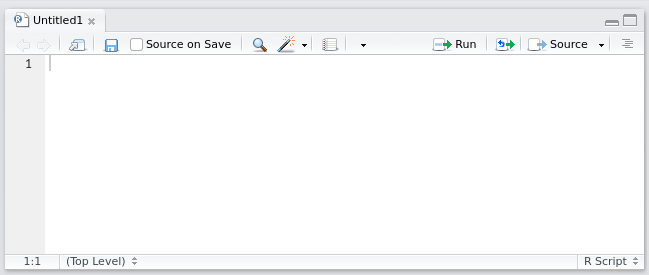
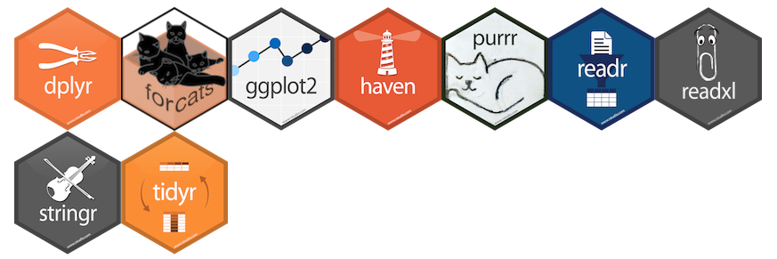

```{r setup, echo = FALSE}
# options(prompt = "> ")
# knitr::opts_chunk$set(prompt = TRUE, comment = NA)
```


# Why use **`R`**?

.pull-left[
## **`R`** is:

- **powerful**

- **reproducible**

- **free** (*libre* and *gratis*)

- **widely used** and **cross-platform**

- **actively** and **openly** developed

- **awesome!**
]

.pull-right[

]

---

# But **`R`** is intimidating!

--

.pull-left[
## Don't worry!

- Lots of good tools and resources

- You don't have to be an expert to use **`R`** effectively

- **`R`** grows with you!
]

.pull-right[

]

---
class: inverse, middle, center
name: getting-started

# Getting Started

---
name: getting-r

# Getting **`R`**

The main **`R`** website is [www.r-project.org](https://www.r-project.org).

--

**`R`** and over 10,000 contributed **`R`** packages are available from **CRAN** 
(the **C**omprehensive **`R`** **A**rchive **N**etwork).

Download and install **`R`** for your operating system at **CRAN**:  
[cloud.r-project.org](https://cloud.r-project.org)


--

I can help on Windows (because I have to) and Linux (because I love to).  
On OS X/macOS, you're on your own. Try the [FAQ](https://cran.r-project.org/bin/macosx/RMacOSX-FAQ.html) 
or these posts by Bob Rudis ([here](https://rud.is/b/2015/10/20/installing-r-on-os-x/) 
and [here](https://rud.is/b/2015/10/22/installing-r-on-os-x-100-homebrew-edition/)).

---
name: rstudio

# Tip \#1: Use **RStudio**

**RStudio** is an integrated development environment (IDE) for **`R`**.

.center[

]

--

Basically, **RStudio** is a **free** program completely dedicated to making **`R`** 
easier to use.

--

The main **RStudio** website is [www.rstudio.com](https://www.rstudio.com).

Download and install **RStudio** for your operating system here:  
[https://www.rstudio.com/products/rstudio/download/](https://www.rstudio.com/products/rstudio/download/)

---

# Tip \#1: Use **RStudio**

.center[
## Do not open **`R`**!

## Open **RStudio** instead!
]

---
background-image: url("./im/RStudio-layout.png")
background-size: contain
class: center, middle

---
class: center, middle, inverse
name: basics

# **`R`** and **RStudio** Basics

---

# **`R`** and **RStudio** Basics

## The **`R`** Console

**`R`** is fundamentally a text-based program.


---

# **`R`** and **RStudio** Basics

## The **`R`** Console

You can type commands directly at the prompt: **`>`**

Press `Enter`, and **`R`** will execute the command and return any output.

--

```r
> 1 + 1
```

`[1] 2`

--

`1 + 1` is the command entered.

`[1] 2` is the output. `[1]` means we're looking at the first element of the 
output. `2` is the result of the calculation.

--

After the command is finished running, you are returned to a new prompt: **`>`**

---

# **`R`** and **RStudio** Basics

**`R`** has many built-in commands (called **functions**).

--

```{r}
date()
```

--

<br />

**`#`** is the **comment** symbol. **`R`** will ignore anything on a line after
`#`.

I will leave off the prompt **`>`** for **`R`** commands and comment **`##`** 
the output to make code easier to copy and paste into your own console from this 
presentation.

---

# **`R`** and **RStudio** Basics

Things inside function calls are called **arguments**.

```{r}
round(3.141593)
round(3.141593, digits = 2)
round(pi, 2)
```

---

# **`R`** and **RStudio** Basics: Help!

To find out about a function in **`R`**, use the built-in help:

```r
?name
```

OR

```r
help(name)
```

--

Use

```r
??keyword
```

to search the built-in help.

---

# **`R`** and **RStudio** Basics: Help!

```r
?round
```

.center[

]

---

# **`R`** and **RStudio** Basics

## Everything that happens in **`R`** is a function call

## Everything that exists in **`R`** is an object

---
name: assignment

# **`R`** and **RStudio** Basics

**`R`** objects can be stored with **`<-`**

--

**`<-`** is the *assignment operator*

```{r}
a <- 6
b <- 1:5
```

--

```{r}
a
b
```

--

Use **`Alt+-`** (`Option+-`) to insert `<-` (surrounded by spaces) in RStudio.

---
name: naming

# **`R`** and **RStudio** Basics

Try to use helpful and consistent names for the objects you create.

--

<br />

> Variable and function names should be lowercase. Use an underscore (`_`) to 
> separate words within a name... Generally, variable names should be nouns and 
> function names should be verbs. Strive for names that are concise and 
> meaningful (this is not easy!).

<br />

&mdash; Hadley Wickham, [*R Packages*](http://r-pkgs.had.co.nz/r.html#style) ([r-pkgs.had.co.nz](http://r-pkgs.had.co.nz))

--

<br />

**Warning**: **`R`** is case-sensitive.  
`Hello_world` is not the same as `hello_world`.

---

# **`R`** and **RStudio** Basics

**Vectors** are ordered groups of objects of the same data type. You can make 
vectors using **`c()`**.

```{r}
numeric_vector <- c(0.5, 0.6)
logical_vector <- c(TRUE, FALSE)
character_vector <- c("a", "b", "cde", "f")
integer_vector <- 2:8
integer_vector_2 <- c(3L, 5L, 4L, 56L)
```

--

Examine the structure of an object using **`str()`**:

```{r}
str(integer_vector)
```

--

Get specific elements of a vector using **`[ ]`**:

```{r}
character_vector[3]
```


---

# **`R`** and **RStudio** Basics

You can even store your own functions in objects!

```{r}
add_two_numbers <- function(x, y) {
    result <- x + y
    result
}
```

--

```{r}
add_two_numbers(4, 6)
```

--

```{r}
addition_result <- add_two_numbers(12, 436)
print(addition_result)
```


---

# **`R`** and **RStudio** Basics

Keep track of objects you have stored in the environment pane:

<br />

.center[

]

---
name: scripts

# Tip \#2: Don't Type at the Console

## Use **`R`** Scripts!

--

**`R`** scripts are plain text files (usually with the extension `.R`) in which 
you can save **`R`** code.

--

**`R`** scripts:

- make it easy to edit and re-run your code

--

- keep a reproducible record of your work

--

Start with a clean workspace at the beginning of each session.

You can easily pick up where you left off by using an **`R`** script!

---

# **`R`** and **RStudio** Basics: Scripts

In RStudio, `File > New File > R Script` will open a new file in the Source 
Editor pane:

.center[

]

--

**`Ctrl+Enter`** (`Cmd+Enter`) to run the current line/selection.

**`source("filename.R")`** to run the whole file.

---
name: style

# **`R`** and **RStudio** Basics: Scripts

**Code with style.**

--

Write code which is meant to be read, even if it is only for you.

--

Follow Hadley Wickham's [code style guidelines](http://r-pkgs.had.co.nz/r.html#style).  
See also [The tidyverse style guide](http://style.tidyverse.org/).

--

- Except indent 4 spaces.
- Unless you don't want to. Just be consistent.

--

Basically, use spaces and punctuation like you normally would in English:

```r
# This function does a thing to the data to prepare it for plotting
do_a_thing <- function(arg_1, arg_2) {
    indented_function_body  # This is how it works
}
```

--

**NOT**

```r
thg<-function(a1,a2){fnbdy}
```

---
name: rstudio-projects

# Tip \#2.5: Use RStudio Projects

--

Create a new project for (stay with me here) each project you work on.

--

`File > New Project`

--

This creates a folder for your project and automatically changes your working 
directory to be in that folder. Keep all files associated with the project in 
this folder.

--

Much confusion is eliminated, as is the need to use `setwd()`.

--

Using RStudio projects in combination with doing all your work in **`R`** scripts 
means you do not need to save your workspace image to `.RData`. In general, 
it is better to start each session with a clean workspace and recreate your work 
via R scripts.

---
name: basic-resources

# **`R`** and **RStudio** Basics: Resources

- *R for Data Science* [workflow basics](http://r4ds.had.co.nz/workflow-basics.html)

- [STAT 545 Basics](http://stat545.com/block002_hello-r-workspace-wd-project.html)

- Free [Introduction to R](https://www.datacamp.com/courses/free-introduction-to-r) 
course at DataCamp

- [swirl](http://swirlstats.com/): Learn R, in R.

- Free [R Programming](https://www.coursera.org/learn/r-programming) course at 
Coursera and its free book:  
[*R Programming for Data Science*](https://leanpub.com/rprogramming) by Roger Peng

- [*Hands on Programming with R*](http://amzn.com/1449359019) by Garrett Grolemund

- [RStudio Essentials](https://www.rstudio.com/resources/webinars/rstudio-essentials-webinar-series-part-1/) 
video (watch at least the first 15&ndash;20 minutes)

- [RStudio IDE Cheat Sheet](https://www.rstudio.com/resources/cheatsheets/)  
In RStudio: `Help > Cheatsheets > RStudio IDE Cheat Sheet`

---
class: center, middle, inverse

# Add Awesome to Your **`R`**

---
name: packages-tidyverse

# Tip \#3: Use Awesome **`R`** Packages!

There are over 10,000 user-contributed packages on CRAN (and many more elsewhere).

--

Base **`R`** is great, but some of the syntax has a pretty steep learning curve. 
Many packages are designed to make **`R`** easier to use.

- Especially those created by Hadley Wickham and the people at RStudio.

--

The [**tidyverse**](http://tidyverse.org/) is a collection of R packages that 
share common philosophies and are designed to work together.



---

# Install and Load Packages

**`R`** has a built-in way to install packages. This will install a fairly large 
set of awesome packages designed to work well together to make your life easier:

```r
install.packages(c("tidyverse", "rmarkdown"))
```

--

Installing the **`tidyverse`** package will install all the packages in the 
tidyverse.

--

If you want to start with a smaller subset of those packages:

```r
install.packages(c("dplyr", "readr", "ggplot2"))
```

---

# Install and Load Packages

To use packages you have installed, use **`library()`**:

--

```{r}
library(tidyverse)
```

--

Packages only need to be installed once, but they need to be loaded each session.
Loading the **`tidyverse`** package will load all the core tidyverse packages 
with one command.

--

**`package::function()`** lets you be explicit about where a function comes from.

---
class: center, middle, inverse

# Make Pretty Pictures

---
name: ggplot2

# Tip \#4: Use **`ggplot2`** for Graphics

**`ggplot2`** is a graphics package by Hadley Wickham which implements the 
**grammar of graphics** to give you an accessible mental model for thinking about 
graphics and allow you to easily and rapidly create new graphics.

--

Example data: `ggplot2::mpg`

```{r}
str(mpg)
```

---
name: data-frames

# Data in Data Frames

"A **data frame** is a rectangular collection of variables (in the columns) and 
observations (in the rows)." 
([*R4DS*](http://r4ds.had.co.nz/data-visualisation.html#first-steps))

"Tibble" is the tidyverse version of a data frame.

--

```{r}
mpg
```

---

# Data in Data Frames

Access a column of a data frame with **`$`**:

```{r}
mpg$displ
```

---

# Plotting with **`ggplot2`**

Create a coordinate system with `ggplot()`, and add layers with **`+`**:

```{r mpg_example, dev = 'svg', fig.align = "center", fig.width = 9, fig.height = 4.3}
ggplot(data = mpg) +
    geom_point(mapping = aes(x = displ, y = hwy, 
                             size = cty, color = class))
```

---

# Add Facets and Smoothers

```{r mpg_example_2, dev = 'svg', fig.align = "center", fig.width = 9, fig.height = 4.7}
ggplot(data = mpg,mapping = aes(x = displ, y = hwy)) +
    geom_point() + geom_smooth(method = "lm") +
    facet_wrap(~ class, nrow = 2)
```


---
name: ggplot2-resources

# **`ggplot2`** Resources

- Official **`ggplot2`** [website](http://ggplot2.org/) and 
[documentation](http://docs.ggplot2.org/current/): 
[http://ggplot2.org/](http://ggplot2.org/)

- Official **`ggplot2`** 
[book](https://www.amazon.com/ggplot2-Elegant-Graphics-Data-Analysis/dp/331924275X/ref=dp_ob_title_bk)

- [STAT 545 Graphics Tutorials](http://stat545.com/graph00_index.html)

- Explanatory videos by Roger Peng: [part 1](https://youtu.be/HeqHMM4ziXA) 
and [part 2](https://youtu.be/n8kYa9vu1l8)

- [Data Visualization Cheat Sheet](https://www.rstudio.com/resources/cheatsheets/)  
In RStudio: `Help > Cheatsheets > Data Visualization with ggplot2`

---
class: center, middle, inverse

# Tidy Your Data

---
name: tidy-data

# Tip \#5: Use Tidy Data

> Write code for humans, write data for computers.
> &mdash; [Vince Buffalo](https://twitter.com/vsbuffalo/statuses/358699162679787521)

--

**Tidy data** is an organizing principle which you can use to structure your data 
to make it easier to work with in **`R`**.

--

[Tidy data](http://r4ds.had.co.nz/tidy-data.html) means:

1. Each variable must have its own column.
2. Each observation must have its own row.
3. Each value must have its own cell.


---

# Tidy Data

Practically, this means **data frames** should be the fundamental way your data 
exist in **`R`**.

--

```{r}
untidy_data <- dplyr::data_frame(Treatment = c("Control", "T3"),
                                 Day1 = c(4.5, 8.7),
                                 Day3 = c(5.4, 9.9))
untidy_data
```

---

# Tidy Data

Practically, this means **data frames** should be the fundamental way your data 
exist in **`R`**.

```{r}
tidy_data <- dplyr::data_frame(Treatment = c("Control", "Control",
                                             "T3", "T3"),
                               Time = c("Day 1", "Day 3", 
                                        "Day 1", "Day 3"),
                               Value = c(4.5, 5.4, 8.7, 9.9))
tidy_data
```

---

# Tidy Data

If you do not have tidy data, the 
[**`tidyr`**](https://github.com/jennybc/lotr-tidy#readme) package can be used 
to tidy your data.

---
name: dplyr

# Tip \#6: Use **`dplyr`**

**`dplyr`** is a package by (you guessed it) Hadley Wickham which provides a 
consistent and approachable grammar for manipulating your data.

--

[**`dplyr`**](http://r4ds.had.co.nz/transform.html#dplyr-basics) provides a 
group of verbs you can use to interact with data frames:

--

1. **`select()`** picks variables (columns of a data frame) by their names.

--

2. **`filter()`** picks observations (rows of a data frame) by their values.

--

3. **`arrange()`** reorders rows.

--

4. **`mutate()`** creates new variables with functions of existing variables.

--

5. **`summarize()`** collapses many values down to single summaries.

--

**`group_by()`** changes these functions from working on the whole data frame to 
working on subsets of the data frame group-by-group.

---
name: dplyr-select

# `dplyr::`**`select()`**

**`select()`** picks variables (columns of a data frame) by their names.

```{r}
select(ggplot2::mpg, manufacturer, displ, cty, hwy)
```

---

# `dplyr::`**`select()`**

The new data frame can be assigned to a new object:

```{r}
small_mpg <- select(ggplot2::mpg, manufacturer, displ, cty, hwy)
small_mpg
```

---
name: dplyr-filter

# `dplyr::`**`filter()`**

**`filter()`** picks observations (rows of a data frame) based on their values.

```{r}
filter(small_mpg, manufacturer == "audi", displ == 2.8)
```


---
name: comparison

# `dplyr::`**`filter()`**

The conditions by which you want to **`filter()`** can use any of **`R`**'s 
comparison operators.

--

- equal: **`==`**

- not equal: **`!=`**

- greater than (or equal to): **`>`** (**`>=`**)

- less than (or equal to): **`<`** (**`<=`**)

--

Multiple arguments passed to **`filter()`** are combined with "and." You can 
make other comparisons using Boolean operators:

--

- and: **`&`**

- or: **`|`**

- not: **`!`**

--

**`%in%`** lets you check if a value is in a given set of values.

---

# `dplyr::`**`filter()`**

```{r}
filter(small_mpg, manufacturer == "audi", displ >= 3.1)
```

--

```{r}
filter(small_mpg, manufacturer == "audi" & displ >= 3.1)
```


---

# `dplyr::`**`filter()`**

```{r}
filter(small_mpg, cty >= 25 | hwy >= 35)
```

---

# `dplyr::`**`filter()`**

```{r}
filter(small_mpg, cty %in% c(15, 19, 26))
```

---
name: dplyr-arrange

# `dplyr::`**`arrange()`**

**`arrange()`** reorders rows, sorting in ascending order.

```{r}
arrange(small_mpg, cty, hwy)
```

---

# `dplyr::`**`arrange()`**

Use **`desc()`** inside `arrange()` to arrange in descending order:

```{r}
arrange(small_mpg, desc(cty), desc(hwy))
```

---
name: dplyr-mutate

# `dplyr::`**`mutate()`**

**`mutate()`** creates new variables with functions of existing variables.

```{r}
mutate(small_mpg, mpg_diff = hwy - cty)
```

---
name: dplyr-summarize

# `dplyr::`**`summarize()`**

**`summarize()`** collapses many values down to single summaries.

```{r}
summarize(small_mpg, city = mean(cty))
```

---
name: dplyr-group_by

# `dplyr::`**`summarize()`**

But, `summarize()` is most useful when used with **`group_by()`**:

```{r}
summarize(group_by(small_mpg, manufacturer), city = mean(cty))
```

---
name: tidy-data-dplyr-resources

# Tidy Data and **`dplyr`** Resources

[Tidy Data and *Lord of the Rings*](https://github.com/jennybc/lotr-tidy/blob/master/01-intro.md) by Jenny Bryan

*R for Data Science*: [Tidy Data](http://r4ds.had.co.nz/tidy-data.html), 
[dplyr](http://r4ds.had.co.nz/transform.html)

Official [Introduction to dplyr](https://cran.r-project.org/web/packages/dplyr/vignettes/introduction.html)

STAT 545 [Basic care and feeding of data in R](http://stat545.com/block006_care-feeding-data.html)

STAT 545 [Introduction to dplyr](http://stat545.com/block009_dplyr-intro.html)

STAT 545 [dplyr functions for a single dataset](http://stat545.com/block010_dplyr-end-single-table.html)

Video [Introduction to the dplyr R package](https://www.youtube.com/watch?v=aywFompr1F4) by Roger Peng

---
class: center, middle, inverse

# Pipe Dreams!

---
name: pipes

# Tip \#6.5: Use Pipes

.center[

]

**`%>%`** is the pipe operator. It is originally from the **`magrittr`** package, 
but it comes with **`dplyr`**.

--

**`%>%`** "pipes" the output of one function to the input of another function.

--

You can use it to chain multiple **`dplyr`** verbs (and other functions) together.

--

In RStudio, **`Ctrl+Shift+M`** (`Cmd+Shift+M`) inserts **`%>%`** surrounded by 
spaces.

---

# Tip \#6.5: Use Pipes

```{r}
ggplot2::mpg %>% mutate(mpg_diff = hwy - cty) %>% 
    group_by(manufacturer) %>% 
    summarize(mpg_diff = mean(mpg_diff)) %>% 
    arrange(desc(mpg_diff)) %>% 
    head(10)
```

---

# Tip \#6.5: Use Pipes

```{r pipe_ex, dev = 'svg', fig.align = "center", fig.width = 9, fig.height = 3.4}
ggplot2::mpg %>% mutate(mpg_diff = hwy - cty) %>% 
    group_by(manufacturer) %>% 
    summarize(mpg_diff = mean(mpg_diff)) %>% 
    arrange(desc(mpg_diff)) %>% 
    mutate(mfr = factor(manufacturer, levels = manufacturer, 
                                 ordered = TRUE)) %>% 
    ggplot(aes(x = mfr, y = mpg_diff)) + geom_col() + 
    theme(axis.text.x = element_text(angle = 45, hjust = 1))
```

---
class: center, middle, inverse

# Get Data Into R

---
name: data-import

# Tip \#7: Use **`readr`** for Data Import

**`read_csv()`** is just like base **`R`**'s `read.csv()`, but it has better 
defaults, and it puts your data into a tibble for use with dplyr.

.footnote[
See [Data Import](http://r4ds.had.co.nz/data-import.html) in *R for Data Science* 
and [Getting data in and out of R](http://stat545.com/block026_file-out-in.html) 
from STAT 545.
]


---
class: center, middle, inverse

# The Latest and Greatest

---
name: update

# Tip \#8: Update **`R`**

New versions of **`R`** are released every 3&ndash;4 months or so.

--

In general, it's best to keep up to date. Most changes will not affect how you 
interact with **`R`**; there are improvements under the hood.

--

Google how to update **`R`** for your operating system. 

- Look at the `installr` package for Windows.

- On Linux, updates should be handled by your distribution's package manager/repositories.

--

**`R` packages** also receive periodic updates.

--

Update the packages you have installed with **`update.packages()`**.

--

- **WARNING**: updates to packages may break your scripts. I'd highly recommend 
avoiding updates during a project (unless you have time to fix anything that 
breaks).


---
class: center, middle, inverse

# HELP!

---
name: help

# Tip \#9: How to Get Help

--

Google is your friend!

--

Often, literally typing your question (with "R" in it) or pasting an error 
message into Google will give you helpful results. There are tons of R blogs and 
other resources readily available.

--

There is an R Help e-mail list, the text of which can be found online. Only 
ask for help on this list if you've tried everything you can possibly think of 
to find the answer yourself, memorized the Posting Guide, and followed the Posting 
Guide meticulously. And don't be surprised if you get a rude answer.

--

You can try [rseek.org](http://rseek.org/) to search Google for **`R`**-specific 
results.

--

Lots of good answers are found at StackExchange / [Stack Overflow](https://stackoverflow.com/questions/tagged/r).

--

Statistics questions are answered at [Cross Validated](http://stats.stackexchange.com/).

--

Ask someone you know in person! I generally would love to help you get better at 
**`R`** and am happy to answer questions.

---
class: center, middle, inverse

# Bonus Tip

---
name: rmarkdown

# Bonus Tip: Use **`R` Markdown**

**`R` Markdown** is a tool for writing **reproducible** data analysis reports.

--

You can integrate **`R`** code with text and create HTML documents, MS Word 
documents, PDFs (via [LaTeX](https://www.latex-project.org/get/)), and slides.

--

- This presentation was made with R Markdown!

--

It's maintained by RStudio, and lots of good resources are found at 
[rmarkdown.rstudio.com](http://rmarkdown.rstudio.com/).


---
background-image: url(`r xaringan:::karl`)
background-position: 50% 50%
class: center, bottom, inverse

# Mustache Karl Approves!

---
name: thanks

# Thanks!

<strong>
## Contact me:

Rick Lindsey

richard.c.lindsey@ricompute.com

## Slides and other resources can be found at: 

[https://ricompute.com/r/](https://ricompute.com/r/)
</strong>

.footnote[
Slides created via the R package [**xaringan**](https://github.com/yihui/xaringan).

The chakra comes from [remark.js](https://remarkjs.com), [**knitr**](http://yihui.name/knitr), and [R Markdown](https://rmarkdown.rstudio.com).
]
