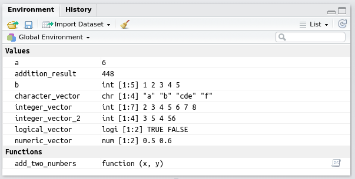

```{r setup, echo = FALSE}
# options(prompt = "> ")
# knitr::opts_chunk$set(prompt = TRUE, comment = NA)
```


# Why use **`R`**?

.pull-left[
## **`R`** is:

- **powerful**

- **reproducible**

- **free** (*libre* and *gratis*)

- **widely used** and **cross-platform**

- **actively** and **openly** developed

- **awesome!**
]

.pull-right[

]

---

# But **`R`** is intimidating!

--

.pull-left[
## Don't worry!

- Lots of good tools and resources

- You don't have to be an expert to use **`R`** effectively

- **`R`** grows with you!
]

.pull-right[

]

---
class: inverse, middle, center

# Getting Started

---

# Getting **`R`**

The main **`R`** website is [www.r-project.org](https://www.r-project.org).

--

**`R`** and over 10,000 contributed **`R`** packages are available from **CRAN** 
(the **C**omprehensive **`R`** **A**rchive **N**etwork).

Download and install **`R`** for your operating system at **CRAN**:  
[cloud.r-project.org](https://cloud.r-project.org)


---

# Tip \#1: Use **RStudio**

**RStudio** is an integrated development environment (IDE) for **`R`**.

.center[

]

--

Basically, **RStudio** is a **free** program completely dedicated to making **`R`** 
easier to use.

--

The main **RStudio** website is [www.rstudio.com](https://www.rstudio.com).

Download and install **RStudio** for your operating system here:  
[https://www.rstudio.com/products/rstudio/download/](https://www.rstudio.com/products/rstudio/download/)

---

# Tip \#1: Use **RStudio**

.center[
## Do not open **`R`**!

## Open **RStudio** instead!
]

---
background-image: url("./im/RStudio-layout-small.png")
class: center, middle

---

# **`R`** and **RStudio** Basics

## The **`R`** Console

**`R`** is fundamentally a text-based program.


---

# **`R`** and **RStudio** Basics

## The **`R`** Console

You can type commands directly at the prompt: **`>`**

Press `Enter`, and **`R`** will execute the command and return any output.

--

```r
> 1 + 1
```

`[1] 2`

--

`1 + 1` is the command entered.

`[1] 2` is the output. `[1]` means we're looking at the first element of the 
output. `2` is the result of the calculation.

--

After the command is finished running, you are returned to a new prompt: **`>`**

---

# **`R`** and **RStudio** Basics

**`R`** has many built-in commands (called **functions**).

--

```{r}
date()
```

--

<br />

**`#`** is the **comment** symbol. **`R`** will ignore anything on a line after
`#`.

I will leave off the prompt **`>`** for **`R`** commands and comment **`##`** 
the output to make code easier to copy and paste into your own console from this 
presentation.

---

# **`R`** and **RStudio** Basics

Things inside function calls are called **arguments**.

```{r}
round(3.141593)
round(3.141593, digits = 2)
round(pi, 2)
```

---

# **`R`** and **RStudio** Basics: Help!

To find out about a function in **`R`**, use the built-in help:

```r
?name
```

OR

```r
help(name)
```

--

Use

```r
??keyword
```

to search the built-in help.

---

# **`R`** and **RStudio** Basics: Help!

```r
?round
```

.center[

]

---

# **`R`** and **RStudio** Basics

## Everything that happens in **`R`** is a function call

## Everything that exists in **`R`** is an object

---

# **`R`** and **RStudio** Basics

**`R`** objects can be stored with **`<-`**

--

**`<-`** is the *assignment operator*

```{r}
a <- 6
b <- 1:5
```

--

```{r}
a
b
```

--

Use **`Alt+-`** (`Option+-`) to insert `<-` (surrounded by spaces) in RStudio.

---

# **`R`** and **RStudio** Basics

Try to use helpful and consistent names for the objects you create.

--

<br />

> Variable and function names should be lowercase. Use an underscore (`_`) to 
> separate words within a name... Generally, variable names should be nouns and 
> function names should be verbs. Strive for names that are concise and 
> meaningful (this is not easy!).

<br />

— Hadley Wickham, [*R Packages*](http://r-pkgs.had.co.nz/r.html#style) ([r-pkgs.had.co.nz](http://r-pkgs.had.co.nz))

---

# **`R`** and **RStudio** Basics

**Vectors** are ordered groups of objects of the same data type. You can make 
vectors using **`c()`**.

```{r}
numeric_vector <- c(0.5, 0.6)
logical_vector <- c(TRUE, FALSE)
character_vector <- c("a", "b", "cde", "f")
integer_vector <- 2:8
integer_vector_2 <- c(3L, 5L, 4L, 56L)
```

--

Examine the structure of an object using **`str()`**:

```{r}
str(integer_vector)
```

---

# **`R`** and **RStudio** Basics

You can even store your own functions in objects!

```{r}
add_two_numbers <- function(x, y) {
    result <- x + y
    result
}
```

--

```{r}
add_two_numbers(4, 6)
addition_result <- add_two_numbers(12, 436)
print(addition_result)
```


---

# **`R`** and **RStudio** Basics

Keep track of objects you have stored in the environment pane:

<br />

.center[

]

---

# Tip \#2: Don't Type at the Console

## Use **`R`** Scripts!


---

# **`R`** and **RStudio** Basics: Resources

- Free [Introduction to R](https://www.datacamp.com/courses/free-introduction-to-r) 
course at DataCamp

- [swirl](http://swirlstats.com/): Learn R, in R.

- Free [R Programming](https://www.coursera.org/learn/r-programming) course at 
Coursera and its free book:  
[*R Programming for Data Science*](https://leanpub.com/rprogramming) by Roger Peng

- [*Hands on Programming with R*](http://amzn.com/1449359019) by Garrett Grolemund

- [RStudio Essentials](https://www.rstudio.com/resources/webinars/rstudio-essentials-webinar-series-part-1/) video (watch at least the first 15—20 minutes)

---

# Tip \#3: Use Awesome **`R`** Packages!

There are over 10,000 user-contributed packages on CRAN (and many more elsewhere).

--

Base **`R`** is great, but some of the syntax has a pretty steep learning curve. 
Many packages are designed to make **`R`** easier to use.

- Especially those created by Hadley Wickham and the people at RStudio.

--

**`R`** has a built-in way to install packages. This will install a fairly large 
set of awesome packages designed to work well together to make your life easier:

```r
install.packages(c("tidyverse", "rmarkdown"))
```

--

If you want to start with a smaller subset of those packages:

```r
install.packages(c("dplyr", "readr", "ggplot2"))
```

---

# Load Packages for Use

To use packages you have installed, use **`library()`**:

--

```{r}
library(tidyverse)
```

--

Packages only need to be installed once, but they need to be loaded each session.

--

**`package::function()`** lets you be explicit about where a function comes from.


---

# Tip \#4: Use **`ggplot2`** for Graphics

**`ggplot2`** is a graphics package by Hadley Wickham which implements the 
**grammar of graphics**.

--


---
background-image: url(`r xaringan:::karl`)
background-position: 50% 50%
class: center, bottom, inverse

# You only live once!

---
class: center, middle

# Thanks!

Slides created via the R package [**xaringan**](https://github.com/yihui/xaringan).

The chakra comes from [remark.js](https://remarkjs.com), [**knitr**](http://yihui.name/knitr), and [R Markdown](https://rmarkdown.rstudio.com).
