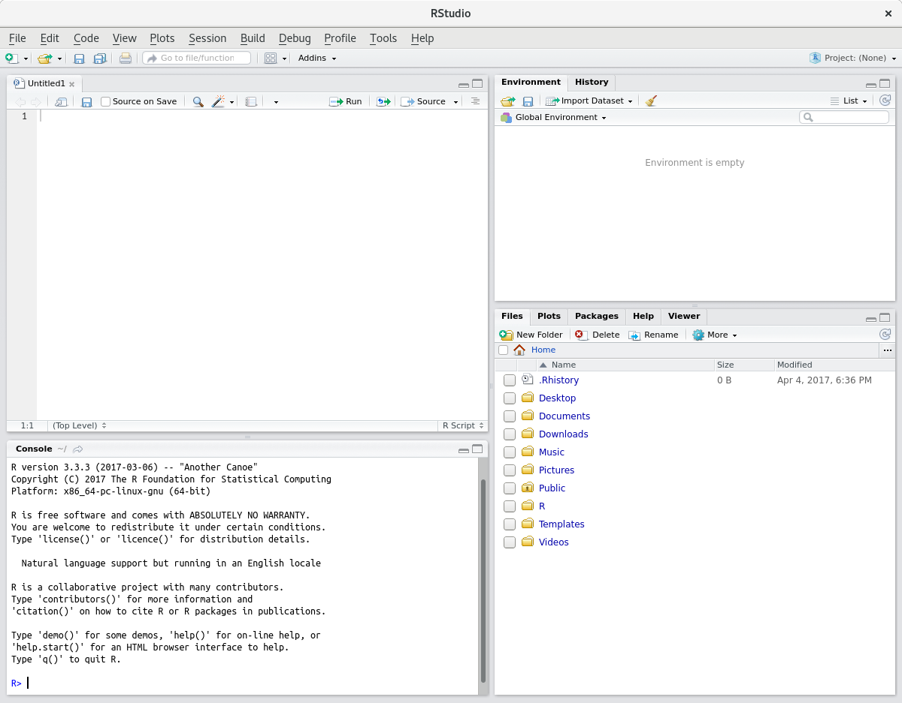
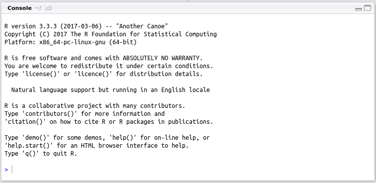

```{r setup, echo = FALSE}
# options(prompt = "> ")
# knitr::opts_chunk$set(prompt = TRUE, comment = NA)
```


# Why use **`R`**?

.pull-left[
## **`R`** is:

- **powerful**

- **reproducible**

- **free** (*libre* and *gratis*)

- **widely used** and **cross-platform**

- **actively** and **openly** developed

- **awesome!**
]

.pull-right[

]

---

# But **`R`** is intimidating!

--

.pull-left[
## Don't worry!

- Lots of good tools and resources

- You don't have to be an expert to use **`R`** effectively

- **`R`** grows with you!
]

.pull-right[

]

---
class: inverse, middle, center

# Getting Started

---

# Getting **`R`**

The main **`R`** website is [www.r-project.org](https://www.r-project.org).

--

**`R`** and over 10,000 contributed **`R`** packages are available from **CRAN** 
(the **C**omprehensive **`R`** **A**rchive **N**etwork).

Download and install **`R`** for your operating system at **CRAN**:  
[cloud.r-project.org](https://cloud.r-project.org)


---

# Tip \#1: Use **RStudio**

**RStudio** is an integrated development environment (IDE) for **`R`**.

.center[

]

--

Basically, **RStudio** is a **free** program completely dedicated to making **`R`** 
easier to use.

--

The main **RStudio** website is [www.rstudio.com](https://www.rstudio.com).

Download and install **RStudio** for your operating system here:  
[https://www.rstudio.com/products/rstudio/download/](https://www.rstudio.com/products/rstudio/download/)

---

# Tip \#1: Use **RStudio**

.center[
## Do not open **`R`**!

## Open **RStudio** instead!
]

---
class: center, middle



---

# **`R`** and **RStudio** Basics

## The **`R`** Console

**`R`** is fundamentally a text-based program.



---

# **`R`** and **RStudio** Basics

## The **`R`** Console

You can type commands directly at the prompt: **`>`**

Press `Enter`, and **`R`** will execute the command and return any output.

--

```r
> 1 + 1
```

`[1] 2`

--

`1 + 1` is the command entered.

`[1] 2` is the output. `[1]` means we're looking at the first element of the 
output. `2` is the result of the calculation.

--

After the command is finished running, you are returned to a new prompt: **`>`**

---

# **`R`** and **RStudio** Basics

**`R`** has many built-in commands (called **functions**).

--

```{r}
date()
```

--

<br />

**`#`** is the **comment** symbol. **`R`** will ignore anything on a line after
`#`.

I will leave off the prompt **`>`** for **`R`** commands and comment **`##`** 
the output to make code easier to copy and paste into your own console from this 
presentation.

---

# **`R`** and **RStudio** Basics

Things inside function calls are called **arguments**.

```{r}
round(3.141593)
round(3.141593, digits = 2)
round(pi, 2)
```

---

# **`R`** and **RStudio** Basics: Help!

To find out about a function in **`R`**, use the built-in help:

```r
?name
```

OR

```r
help(name)
```

--

Use

```r
??keyword
```

to search the built-in help.

---

# **`R`** and **RStudio** Basics: Help!

```r
?round
```


---
background-image: url(`r xaringan:::karl`)
background-position: 50% 50%
class: center, bottom, inverse

# You only live once!

---

# Hello Ninja

As a presentation ninja, you certainly should not be satisfied by the "Hello World" example. You need to understand more about two things:

1. The [remark.js](https://remarkjs.com) library;

1. The **xaringan** package;

Basically **xaringan** injected the chakra of R Markdown (minus Pandoc) into **remark.js**. The slides are rendered by remark.js in the web browser, and the Markdown source needed by remark.js is generated from R Markdown (**knitr**).

---

# remark.js

You can see an introduction of remark.js from [its homepage](https://remarkjs.com). You should read the [remark.js Wiki](https://github.com/gnab/remark/wiki) at least once to know how to

- create a new slide (Markdown syntax<sup>*</sup> and slide properties);

- format a slide (e.g. text alignment);

- configure the slideshow;

- and use the presentation (keyboard shortcuts).

It is important to be familiar with remark.js before you can understand the options in **xaringan**.

.footnote[[*] It is different with Pandoc's Markdown! It is limited but should be enough for presentation purporses. Come on... You do not need a slide for the Table of Contents! Well, the Markdown support in remark.js [may be improved](https://github.com/gnab/remark/issues/142) in the future.]

---
background-image: url(`r xaringan:::karl`)
background-size: cover
class: center, bottom, inverse

# I was so happy to have discovered remark.js!

---
class: inverse, middle, center

# Using xaringan

---

# xaringan

Provides an R Markdown output format `xaringan::moon_reader` as a wrapper for remark.js, and you can use it in the YAML metadata, e.g.

```yaml
---
title: "A Cool Presentation"
output:
  xaringan::moon_reader
    yolo: true
    nature:
      autoplay: 30000
---
```

See the help page `?xaringan::moon_reader` for all possible options that you can use.

---

# remark.js vs xaringan

Some differences between using remark.js (left) and using **xaringan** (right):

.pull-left[
1. Start with a boilerplate HTML file;

1. Plain Markdown;

1. Write JavaScript to autoplay slides;

1. Manually configure MathJax;

1. Highlight code with `*`;

1. Edit Markdown source and refresh browser to see updated slides;
]

.pull-right[
1. Start with an R Markdown document;

1. R Markdown (can embed R/other code chunks);

1. Provide an option `autoplay`;

1. MathJax just works;<sup>*</sup>

1. Highlight code with `{{}}`;

1. The RStudio addin "Infinite Moon Reader" automatically refreshes slides on changes;
]

.footnote[[*] Not really. See next page.]

---

# Math Expressions

You can write LaTeX math expressions inside a pair of dollar signs, e.g. &#36;\alpha+\beta$ renders $\alpha+\beta$. You can use the display style with double dollar signs:

```
$$\bar{X}=\frac{1}{n}\sum_{i=1}^nX_i$$
```

$$\bar{X}=\frac{1}{n}\sum_{i=1}^nX_i$$

Limitations:

1. The source code of a LaTeX math expression must be in one line, unless it is inside a pair of double dollar signs, in which case the starting `$$` must appear in the very beginning of a line, followed immediately by a non-space character, and the ending `$$` must be at the end of a line, led by a non-space character;

1. There should not be spaces after the opening `$` or before the closing `$`.

---

# R Code

```{r comment='#'}
# a boring regression
fit = lm(dist ~ 1 + speed, data = cars)
coef(summary(fit))
dojutsu = c('地爆天星', '天照', '加具土命', '神威', '須佐能乎', '無限月読')
grep('天', dojutsu, value = TRUE)
```

---

# R Plots

```{r cars, fig.height=4, dev='svg'}
par(mar = c(4, 4, 1, .1))
plot(cars, pch = 19, col = 'darkgray', las = 1)
abline(fit, lwd = 2)
```

---

# HTML Widgets

I have not thoroughly tested HTML widgets against **xaringan**. Some may work well, and some may not. It is a little tricky.

Similarly, the Shiny mode (`runtime: shiny`) does not work. I might get these issues fixed in the future, but these are not of high priority to me. I never turn my presentation into a Shiny app. When I need to demonstrate more complicated examples, I just launch them separately. It is convenient to share slides with other people when they are plain HTML/JS applications.

See the next page for two HTML widgets.


---

# Some Tips

- When you use the "Infinite Moon Reader" addin in RStudio, your R session will be blocked by default. You can click the red button on the right of the console to stop serving the slides, or use the _daemonized_ mode so that it does not block your R session. To do the latter, you can set the option

    ```r
    options(servr.daemon = TRUE)
    ```
    
    in your current R session, or in `~/.Rprofile` so that it is applied to all future R sessions. I do the latter by myself.
    
    To know more about the web server, see the [**servr**](https://github.com/yihui/servr) package.

--

- Do not forget to try the `yolo` option of `xaringan::moon_reader`.

    ```yaml
    output:
      xaringan::moon_reader:
        yolo: true
    ```

---

# Some Tips

- Slides can be automatically played if you set the `autoplay` option under `nature`, e.g. go to the next slide every 30 seconds (this can be useful for lightning talks):

    ```yaml
    output:
      xaringan::moon_reader:
        nature:
          autoplay: 30000
    ```

--

- The option `highlightLines: true` of `nature` will highlight code lines that start with `*` or are wrapped in `{{ }}`;

    ```yaml
    output:
      xaringan::moon_reader:
        nature:
          highlightLines: true
    ```

    See examples on the next page.

---

# Some Tips


.pull-left[
An example using a leading `*`:

    ```r
    if (TRUE) {
    ** message("Very important!")
    }
    ```
Output:
```r
if (TRUE) {
* message("Very important!")
}
```

This is invalid R code, so it is a plain fenced code block that is not executed.
]

.pull-right[
An example using `{{}}`:

    `r ''````{r tidy=FALSE}
    if (TRUE) {
    *{{ message("Very important!") }}
    }
    ```
Output:
```{r tidy=FALSE}
if (TRUE) {
{{ message("Very important!") }}
}
```

It is valid R code so you can run it.
]

---

# Some Tips

- To make slides work offline, you need to download a copy of remark.js in advance, because **xaringan** uses the online version by default (see the help page `?xaringan::moon_reader`).

- You can use `xaringan::summon_remark()` to download the latest or a specified version of remark.js. By default, it is downloaded to `libs/remark-latest.min.js`.

- Then change the `chakra` option in YAML to point to this file, e.g.

    ```yaml
    output:
      xaringan::moon_reader:
        chakra: libs/remark-latest.min.js
    ```

- If you used Google fonts in slides (the default theme uses _Yanone Kaffeesatz_, _Droid Serif_, and _Source Code Pro_), they won't work offline unless you download or install them locally. The Heroku app [google-webfonts-helper](https://google-webfonts-helper.herokuapp.com/fonts) can help you download fonts and generate the necessary CSS.


---

# CSS

Among all options in `xaringan::moon_reader`, the most challenging but perhaps also the most rewarding one is `css`, because it allows you to customize the appearance of your slides using any CSS rules or hacks you know.

You can see the default CSS file [here](https://github.com/yihui/xaringan/blob/master/inst/rmarkdown/templates/xaringan/resources/example.css). You can completely replace it with your own CSS files, or define new rules to override the default.

---

# CSS

For example, suppose you want to change the font for code from the default "Source Code Pro" to "Ubuntu Mono". You can create a CSS file named, say, `ubuntu-mono.css`:

```css
@import url(https://fonts.googleapis.com/css?family=Ubuntu+Mono:400,700,400italic);

.remark-code, .remark-inline-code { font-family: 'Ubuntu Mono'; }
```

Then set the `css` option in the YAML metadata:

```yaml
output:
  xaringan::moon_reader:
    css: ["default", "ubuntu-mono.css"]
```

Here I assume `ubuntu-mono.css` is under the same directory as your Rmd.

---
class: inverse, middle, center
background-image: url(https://upload.wikimedia.org/wikipedia/commons/3/39/Naruto_Shiki_Fujin.svg)
background-size: contain

# Naruto

---
background-image: url(https://upload.wikimedia.org/wikipedia/commons/b/be/Sharingan_triple.svg)
background-size: 100px
background-position: 90% 8%

# Sharingan

The R package name **xaringan** was derived<sup>1</sup> from **Sharingan**, a dōjutsu in the Japanese anime _Naruto_ with two abilities:

- the "Eye of Insight"

- the "Eye of Hypnotism"

I think a presentation is basically a way to communicate insights to the audience, and a great presentation may even "hypnotize" the audience.<sup>2,3</sup>

.footnote[
[1] In Chinese, the pronounciation of _X_ is _Sh_ /ʃ/ (as in _shrimp_). Now you should have a better idea of how to pronounce my last name _Xie_.

[2] By comparison, bad presentations only put the audience to sleep.

[3] Personally I find that setting background images for slides is a killer feature of remark.js. It is an effective way to bring visual impact into your presentations.
]

---

# Naruto terminology

The **xaringan** package borrowed a few terms from Naruto, such as

- [Sharingan](http://naruto.wikia.com/wiki/Sharingan) (写輪眼; the package name)

- The [moon reader](http://naruto.wikia.com/wiki/Moon_Reader) (月読; an attractive R Markdown output format)

- [Chakra](http://naruto.wikia.com/wiki/Chakra) (查克拉; the path to the remark.js library, which is the power to drive the presentation)

- [Nature transformation](http://naruto.wikia.com/wiki/Nature_Transformation) (性質変化; transform the chakra by setting different options)

- The [infinite moon reader](http://naruto.wikia.com/wiki/Infinite_Tsukuyomi) (無限月読; start a local web server to continuously serve your slides)

- The [summoning technique](http://naruto.wikia.com/wiki/Summoning_Technique) (download remark.js from the web)

You can click the links to know more about them if you want. The jutsu "Moon Reader" may seem a little evil, but that does not mean your slides are evil.

---

class: center

# Hand seals (印)

Press `h` or `?` to see the possible ninjutsu you can use in remark.js.


---

class: center, middle

# Thanks!

Slides created via the R package [**xaringan**](https://github.com/yihui/xaringan).

The chakra comes from [remark.js](https://remarkjs.com), [**knitr**](http://yihui.name/knitr), and [R Markdown](https://rmarkdown.rstudio.com).
