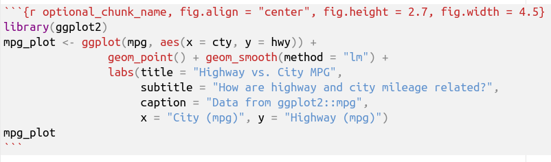
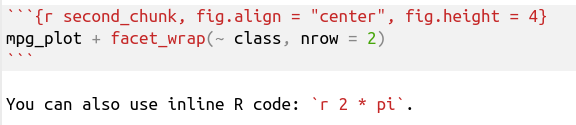

```{r setup, include = FALSE}
knitr::opts_chunk$set(dev = 'svg')
```


# R Markdown

.center[

]

**R Markdown** is a way to integrate code with text to produce reproducible 
data analysis documents.

--

Using the same basic plain text document, R Markdown can produce:

- HTML documents
- PDFs (via [LaTeX](https://www.latex-project.org/get/))
- MS Word documents
- and much, much more!

---

# Get R Markdown

.center[

]

--

**R Markdown** is an R package maintained by the RStudio team.

--

```r
install.packages("rmarkdown")
```

--

R Markdown integrates seamlessly with the RStudio IDE!

--

But, you can use R Markdown without RStudio if you must.

--

R Markdown requires [Pandoc](http://pandoc.org/) to be installed.  
Don't worry! Pandoc comes with RStudio!

---

# Structure of an R Markdown Document

An R Markdown document is a plain text document with the extension **`.Rmd`**.

--

In RStudio, `File > New File > R Markdown...`

--

## YAML Header

```yaml
---
title: "This is a Document!"
author: "Rick Lindsey"
date: "`r format(Sys.time(), '%B %d, %Y')`"
output: html_document
---
```

---

# Write Text in Markdown

**Markdown** is a simple plain text formatting syntax created by 
[John Gruber](http://daringfireball.net/projects/markdown/).

R Markdown uses a slightly extended version of 
[Pandoc's Markdown](http://rmarkdown.rstudio.com/authoring_pandoc_markdown.html).

--

```markdown
# Header 1

Normal, plain text is writen just like normal text.
You can do bulleted lists:

- italics are done with *single asterisks*
- bold is done with **double asterisks**
- inline code is formatted with `single backticks`
- links are with [square brackets](https://rmarkdown.rstudio.com)

## Header 2

And you can do numbered lists:

1. Inline LaTeX math: $Y = f(X) + \epsilon$
1. And here's another point.
1. And a third.
```

---

# Header 1

Normal, plain text is writen just like normal text.
You can do bulleted lists:

- italics are done with *single asterisks*
- bold is done with **double asterisks**
- inline code is formatted with `single backticks`
- links are with [square brackets](https://rmarkdown.rstudio.com)

## Header 2

And you can do numbered lists:

1. Inline LaTeX math: $Y = f(X) + \epsilon$
1. And here's another point.
1. And a third.

---

# Write R Code in Code Chunks

In RStudio, insert a code chunk with **`Ctrl+Alt+I`** (`Cmd+Option+I`).

**`Ctrl+Shift+Enter`** (`Cmd+Shift+Enter`) runs all code in the chunk.

--

<br />

.center[

]

---

# Write R Code in Code Chunks

```{r optional_chunk_name, fig.align = "center", fig.height = 2.7, fig.width = 4.5}
library(ggplot2)
mpg_plot <- ggplot(mpg, aes(x = cty, y = hwy)) +
                geom_point() + geom_smooth(method = "lm") + 
                labs(title = "Highway vs. City MPG",
                     subtitle = "How are highway and city mileage related?",
                     caption = "Data from ggplot2::mpg",
                     x = "City (mpg)", y = "Highway (mpg)")
mpg_plot
```

---

# Write R Code in Code Chunks

R objects you create in one code chunk are available in later chunks.

<br />

.center[

]

---

# Write R Code in Code Chunks

```{r second_chunk, fig.align = "center", fig.height = 4}
mpg_plot + facet_wrap(~ class, nrow = 2)
```

You can also use inline R code: `r 2 * pi`.

---

# Render Your Document

In RStudio, **`Ctrl+Shift+K`** (`Cmd+Shift+K`) produces your document.

Without RStudio, `rmarkdown::render("document.Rmd")` at the R prompt.

--

To change output format, change `html_document` in the YAML header to `pdf_document` 
or `word_document`.

```yaml
---
title: "This is a Document!"
author: "Rick Lindsey"
date: "`r format(Sys.time(), '%B %d, %Y')`"
output: pdf_document
---
```

---

# R Markdown Resources

https://rmarkdown.rstudio.com

[R Markdown Cheat Sheet](https://www.rstudio.com/resources/cheatsheets/)  
In RStudio, `Help > Cheatsheets > R Markdown Cheat Sheet` and  
`Help > Cheatsheets > R Markdown Reference Guide`

